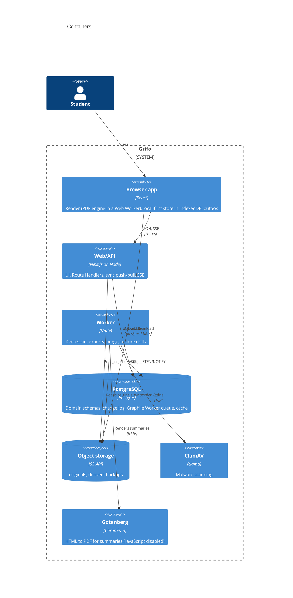

# C4 — Containers

```mermaid
C4Container
  title Containers
  Person(student, "Student")
  System_Boundary(sys, "Grifo") {
    Container(client, "Browser app", "React", "Reader (PDF engine in a Web Worker), local-first store in IndexedDB, outbox")
    Container(web, "Web/API", "Next.js on Node", "UI, Route Handlers, sync push/pull, SSE")
    Container(worker, "Worker", "Node", "Deep scan, exports, purge, restore drills")
    ContainerDb(db, "PostgreSQL", "Postgres", "Domain schemas, change log, Graphile Worker queue, cache")
    ContainerDb(s3, "Object storage", "S3 API", "originals, derived, backups")
    Container(av, "ClamAV", "clamd", "Malware scanning")
    Container(pdfr, "Gotenberg", "Chromium", "HTML to PDF for summaries (JavaScript disabled)")
  }

  Rel(student, client, "Uses")
  Rel(client, web, "JSON, SSE", "HTTPS")
  Rel(client, s3, "Upload/download", "presigned URLs")
  Rel(web, db, "SQL with RLS")
  Rel(web, s3, "Presigns, checks objects")
  Rel(worker, db, "SQL, LISTEN/NOTIFY")
  Rel(worker, s3, "Reads originals, writes derived")
  Rel(worker, av, "Scans", "TCP")
  Rel(worker, pdfr, "Renders summaries", "HTTP")
```
