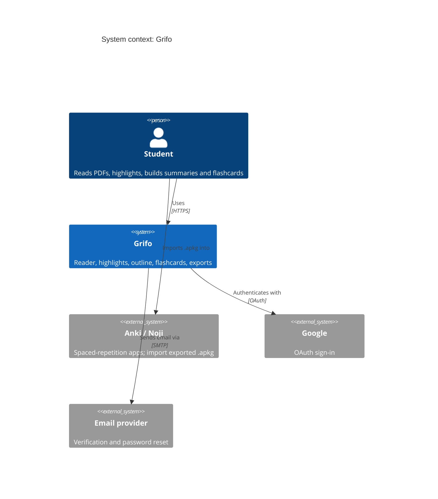

# C4 — System context

```mermaid
C4Context
  title System context: Grifo
  Person(student, "Student", "Reads PDFs, highlights, builds summaries and flashcards")
  System(app, "Grifo", "Reader, highlights, outline, flashcards, exports")
  System_Ext(srs, "Anki / Noji", "Spaced-repetition apps; import exported .apkg")
  System_Ext(google, "Google", "OAuth sign-in")
  System_Ext(mail, "Email provider", "Verification and password reset")

  Rel(student, app, "Uses", "HTTPS")
  Rel(student, srs, "Imports .apkg into")
  Rel(app, google, "Authenticates with", "OAuth")
  Rel(app, mail, "Sends email via", "SMTP")
```
